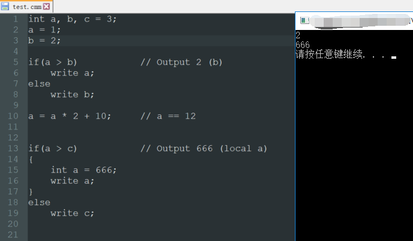

# Cmm Compiler #

This is a Cmm(C Minus Minus) compiler written in C++. It can parse and output results of any standard cmm codes.

The complier includes lexical analysis, syntatic analysis, semantic analysis and execution. For implementation details, please refer to the doc file.

Here is an example execution:

